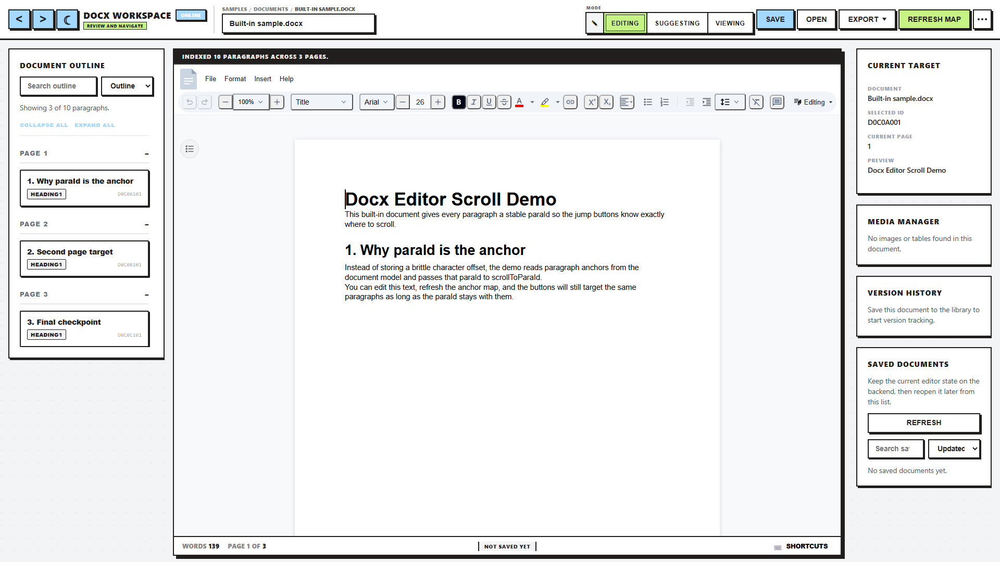

# DocxCraft Editor

[](https://github.com/KasierBach/DocxCraft-Editor/actions/workflows/ci.yml)
[](https://github.com/KasierBach/DocxCraft-Editor/actions/workflows/codeql.yml)
[](LICENSE)
[](package.json)
[](https://github.com/KasierBach/DocxCraft-Editor/pkgs/container/docxcraft-editor)

**A local-first `.docx` editor that runs in your browser — your documents never leave your machine.**



Built on [`@eigenpal/docx-editor-react`](https://www.docx-editor.dev/), with a Neo-Brutalism UI crafted for a seamless, Word-like editing experience.

## Why DocxCraft?

- **Your documents never leave your machine.** Edit contracts, résumés, and confidential reports without uploading them to anyone's cloud — no account, no subscription, no telemetry. It's your API, your disk.
- **Real `.docx` files, zero lock-in.** Documents are stored as native Word files on your own disk — open them in Microsoft Word, LibreOffice, or anything else, anytime. No exports, no conversions, no proprietary database.
- **Built so you can't lose work.** Autosave backs up unsaved edits to IndexedDB, every save creates a restorable version, and a reload after a crash offers your work back — conflicts are rejected, never silently overwritten.
- **Self-host in one command, use it anywhere.** One `docker run` on a home server, NAS, or VPS puts the full editor in your browser — desktop, tablet, or phone, with a UI built for each.

## Features

- Open and edit `.docx` files directly in the browser — with **editing, suggesting, and viewing modes**
- **Document library** — save, rename, duplicate, and delete documents; **version history** with restore/download on every save
- **Anchor Map** — a live outline of headings and paragraphs by page that follows your cursor and jumps with a flash highlight
- **Crash recovery** — unsaved work is auto-backed-up to IndexedDB and offered for restore after a reload
- **Command palette, keyboard shortcuts, deep links** — full keyboard-driven workflow (`Ctrl+/` for the cheat sheet)
- **Responsive everywhere** — three-column desktop workspace; tablet and phone layouts collapse the sidebars into drawers
- **Optional passphrase auth** — deployed instances show a landing page; the first visit claims the instance by setting a passphrase, later visitors sign in
- **Onboarding tour** — a three-step welcome walkthrough shown once after first sign-in

<details>
<summary><strong>Everything else</strong></summary>

- **Save-in-place** — saving never re-mounts the editor or loses cursor position
- **Optimistic concurrency** — saves carry an `If-Match` revision; the server rejects stale overwrites with `409`
- **Media Manager** — jump-to navigation for images and tables in the document
- **Dark Mode** — manual toggle plus OS preference detection, persisted across sessions
- **Status Bar** — live word count, page count, and last-saved timestamp
- Toast notifications for all document actions and errors
- Error Boundary for graceful crash recovery

</details>

## Quick Start

**Self-host (Docker):**

```bash
docker run -d -p 4175:4175 -v docxcraft-data:/app/data ghcr.io/kasierbach/docxcraft-editor
# or: docker compose up -d
```

Open http://localhost:4175 — done. Documents persist in the `docxcraft-data` volume.

**Develop locally:**

```bash
npm install
npm run dev
```

- Frontend: [http://localhost:5136](http://localhost:5136)
- API: [http://127.0.0.1:4175/api/health](http://127.0.0.1:4175/api/health)

Requires Node.js ≥ 22.12 and npm. The API binds to `127.0.0.1` by default; configure `HOST`, `PORT`, `CORS_ORIGIN`, `DATA_DIR`, and `LOG_LEVEL` via the variables in `.env.example`. If port `4175` already has a compatible server running, the dev launcher reuses it.

<details>
<summary><strong>Production without Docker</strong></summary>

```bash
npm run build
npm run server
```

The Fastify server serves the built bundle from `dist/` alongside the API on one port — no separate static host needed:

- `/` and static assets come from `dist/`; hashed assets are served with `cache-control: public, max-age=30d, immutable`, `index.html` with `no-cache`
- Unknown non-API paths fall back to `index.html` (SPA deep links keep working); `/api/*` 404s stay JSON, and missing bundles return a real 404
- When `dist/` does not exist (API-only deployments), static serving is skipped automatically; set `staticDir: ''` in `buildDocumentApiApp` to disable it explicitly
- Set `NODE_ENV=production` for structured JSON logs; `HOST`/`PORT` control binding (keep `127.0.0.1` unless you have read [SECURITY.md](SECURITY.md))
- To run the frontend on a separate static host instead, deploy `dist/` and point it at the API with `CORS_ORIGIN` configured

The Docker image is multi-stage (build → `node:22-slim` runtime running as a non-root user), binds to `0.0.0.0`, includes a container `HEALTHCHECK` against `/api/health`, and is published to GHCR on every `v*` tag with provenance and SBOM attestations.

</details>

### Deploy on a free VM (Oracle Cloud Always Free)

Public deployments get a landing page, first-run passphrase claiming, and automatic HTTPS. `deploy/` contains a compose file that runs the app behind Caddy with Let's Encrypt certificates — using a free `sslip.io` hostname derived from the VM's IP, so no domain purchase is needed.

```bash
# on the VM (Ubuntu, Docker installed):
git clone https://github.com/KasierBach/DocxCraft-Editor.git
cd DocxCraft-Editor/deploy

# Derive the hostname from the VM's public IP (dashes for dots):
# 140.238.10.20 -> docx-140-238-10-20.sslip.io
SITE_ADDRESS='docx-140-238-10-20.sslip.io' docker compose up -d
```

Open `https://docx-<vm-ip-with-dashes>.sslip.io` — the landing page loads with a **"Get started"** button: the first visit claims the instance by setting your passphrase (stored hashed, no recovery — make it memorable). Afterwards the landing page shows **"Sign in"**, and the editor greets you with a one-time onboarding tour. Documents persist in the `docxcraft-data` volume across reboots and redeploys.

**Auth configuration** — auth is off by default (localhost use). Options:

- `AUTH_MODE=claim` — first visitor sets the passphrase; the hash persists in `data/auth.json` (inside the data volume). Best for fresh deployments.
- `AUTH_PASSPHRASE_HASH` — `scrypt:<salt>:<hash>` from `npm run hash-passphrase -- "your-passphrase"`; pre-seeds the passphrase and disables claiming.
- `AUTH_PASSPHRASE` — plaintext convenience, hashed at boot.

When auth is active, all `/api/*` routes except `session`/`login`/`logout`/`setup` require an HTTP-only session cookie (7-day expiry, `SameSite=Strict`, `Secure` behind HTTPS). Login and setup attempts are rate-limited to 5 per minute independently of the global API limit.

**Local development and the landing page** — `npm run dev` starts the full gated experience: the landing page, first-run passphrase setup, and sign-in. Claim the instance once (the hash persists in `data/auth.json`, the session cookie lasts 7 days); delete `data/auth.json` to reset and see the setup flow again. Use `npm run dev:plain` (or `AUTH_MODE=off`) to skip auth and open the editor directly.

<details>
<summary><strong>Project structure</strong></summary>

```
src/
  App.tsx                  — main shell, editor orchestration, anchor sync
  components/
    layout/
      Header.tsx           — toolbar, document name, action buttons
      Sidebar.tsx          — left panel with AnchorNavigator
      RightSidebar.tsx     — media manager, version history, saved documents
      EditorStatusBar.tsx  — word count, page, save status
      Breadcrumbs.tsx      — page breadcrumb indicator
    ui/
      CommandPalette.tsx   — quick-action palette
      ShortcutHelpModal.tsx
      Panel.tsx            — shared panel wrapper
  hooks/
    useAnchors.ts          — anchor state, filter, active paragraph tracking
    useDocumentLibrary.ts  — saved document list + revision management
    useDocumentCommands.ts — shared error/success handling for commands
    useRecoveryDraft.ts    — auto-backup and restore
    useKeyboardShortcuts.ts
    useApiStatus.ts        — backend health polling
    useTheme.ts            — dark mode + OS preference
    useToastManager.ts
  lib/
    anchors.ts             — collect anchor targets from page content
    resolveActiveAnchor.ts — resolve current active anchor from selection
    deepLink.ts            — URL-based document deep linking
    documentApi.ts         — HTTP client for backend routes (timeouts + dedupe)
    flashHighlight.ts      — anchor jump flash-highlight with retry + cancel
    format.ts              — shared byte and date formatting
    headings.ts            — shared Word heading-style parser
    mediaScanner.ts        — scan ProseMirror doc for images/tables
    recoveryStore.ts       — IndexedDB recovery snapshot storage (localStorage fallback)
  styles/
    base/                  — reset, tokens, dark mode
    layout/                — main layout, status bar, breadcrumbs
    components/            — header, sidebar, navigation, editor, toasts

server/
  app.ts                   — Fastify app, routes, Zod validation, CORS, rate limit, static serving
  docxValidation.ts        — pre-decompression ZIP central-directory validation
  documentStore.ts         — file-backed .docx storage + metadata index
  logger.ts                — pino logger setup

shared/
  types.ts                 — shared types between frontend and backend

scripts/
  dev.ts                   — dev launcher (starts API then Vite)

e2e/                       — Playwright browser + API tests
```

</details>

<details>
<summary><strong>Available scripts</strong></summary>

| Script | Description |
|---|---|
| `npm run dev` | Start frontend + API together (full experience with landing page and passphrase auth) |
| `npm run dev:plain` | Start without auth — the editor opens directly |
| `npm run dev:web` | Start Vite frontend only |
| `npm run dev:api` | Start Fastify API only |
| `npm run build` | Build production bundle |
| `npm run typecheck` | Run TypeScript checks without emitting files |
| `npm run lint` | Run ESLint |
| `npm test` | Run unit test suite |
| `npm run test:coverage` | Run unit tests with coverage thresholds |
| `npm run test:e2e` | Run Playwright browser tests (Chromium, Firefox, WebKit, mobile) |
| `npm run preview` | Preview production build |

</details>

<details>
<summary><strong>API overview</strong></summary>

All routes are versioned via an `apiVersion` field on `/api/health`. Uploads are limited to 50 MiB and rate-limited to 300 requests/minute.

| Method | Route | Description |
|---|---|---|
| `GET` | `/api/health` | Liveness check |
| `GET` | `/api/ready` | Storage integrity check |
| `GET` | `/api/documents` | List saved documents |
| `POST` | `/api/documents` | Upload a new document (body: DOCX binary, `x-document-name` header) |
| `PUT` | `/api/documents/:id` | Update a document; optional `If-Match: "<revision>"` for conflict detection |
| `PATCH` | `/api/documents/:id` | Rename a document (JSON body `{ "name": "..." }`) |
| `DELETE` | `/api/documents/:id` | Delete a document and its versions |
| `POST` | `/api/documents/:id/duplicate` | Duplicate a document |
| `GET` | `/api/documents/:id/content` | Download latest content (`?markOpened=true` touches `lastOpenedAt`) |
| `GET` | `/api/documents/:id/versions` | List version metadata |
| `GET` | `/api/documents/:id/versions/:versionId/content` | Download a specific version |

Document names travel URL-encoded in the `x-document-name` header; the `Content-Disposition` on downloads includes both an ASCII fallback and a UTF-8 encoded filename.

</details>

<details>
<summary><strong>Storage &amp; upload hardening</strong></summary>

**Local document storage** — saved documents live in `data/documents/` (excluded from version control):

- `data/documents/<documentId>/<versionId>.docx` — one file per saved version
- `data/documents/index.json` — metadata index (atomic writes via temp file + rename)

Writes are serialized through an internal queue; version pruning (max 100 per document) commits the index before removing files so a crash mid-prune cannot leave dangling index entries. `/api/ready` verifies index/file consistency on demand.

**DOCX upload validation** — uploads are validated before decompression by parsing the ZIP central directory directly:

- ZIP signature and structure checks
- Entry count limit (10,000)
- Path traversal rejection (`..` segments)
- Required OOXML entries (`[Content_Types].xml`, `word/document.xml`)
- Uncompressed size limit (200 MiB) and per-entry/total compression-ratio limits (zip-bomb defense)
- ZIP64 archives are rejected
- CRC32 verification via JSZip after the header checks pass

</details>

<details>
<summary><strong>Keyboard shortcuts</strong></summary>

The shortcut list lives in `SHORTCUT_SPECS` in `src/App.tsx` and is rendered by the in-app help (`Ctrl+/`).

| Shortcut | Action |
|---|---|
| `Ctrl+S` | Save |
| `Ctrl+Shift+S` | Save as copy |
| `Ctrl+O` | Open file |
| `Ctrl+/` | Shortcut help |
| `Ctrl+\` | Toggle outline sidebar |
| `Ctrl+I` | Toggle details sidebar |
| `Ctrl+P` | Command palette |

</details>

<details>
<summary><strong>Testing &amp; CI</strong></summary>

- **Unit** (`npm test`) — jsdom environment, `@testing-library/react`, per-module store/api mocks; see the run output for the current count
- **Coverage** (`npm run test:coverage`) — thresholds enforced (lines/statements/functions 70%, branches 58%)
- **E2E** (`npm run test:e2e`) — Playwright with Chromium, Firefox, WebKit, and mobile Chromium projects; includes API lifecycle, document workflow, theme persistence, responsive layout checks at 1920→320 px viewports, and accessibility (axe) checks. Playwright starts both servers itself (auth disabled, so stop any running `npm run dev` first).
- **CI** (`.github/workflows/ci.yml`) — lint, typecheck, coverage, e2e, and build on every push and PR (nightly on `main`); CodeQL analysis, Dependabot updates, and Docker/GHCR publishing run in their own workflows. Releasing a `v*` tag re-verifies the full suite and attaches the bundle, checksums, and SBOM.

</details>

## Known Limits

- File storage is single-process and file-backed; use a database/object store before running multiple API instances
- No authentication, authorization, sharing, or collaboration — see [SECURITY.md](SECURITY.md) before exposing the API beyond localhost
- ZIP validation covers the central directory and CRC32; deeply malformed OOXML content is only rejected by the editor runtime, not the API
- Production bundle is large due to the editor runtime

## License

[MIT](LICENSE)

## Hosted deployment hardening

The hosted build (Postgres + OAuth accounts) needs operational pieces the self-host image does not:

- **Edge/WAF** — put Cloudflare (free plan) in front of Caddy for WAF, bot management, DDoS absorption, and CDN caching. Keep Caddy for TLS.
- **Uptime + errors** — monitor `GET /api/health` and add error tracking (e.g. Sentry) via the edge or a log drain.
- **Backups** — take logical dumps regularly and rehearse a restore:

  ```sh
  docker compose -f docker-compose.dev.yml exec -T postgres \
    pg_dump -U docxcraft docxcraft > backup.sql
  cat backup.sql | docker compose -f docker-compose.dev.yml exec -T postgres \
    psql -U docxcraft -d docxcraft
  ```

  Enable versioning and a lifecycle policy on the blob bucket as well.
- **Migrations** — run `npm run db:migrate` (Prisma migrate deploy) as a deploy step before starting the new app version.
